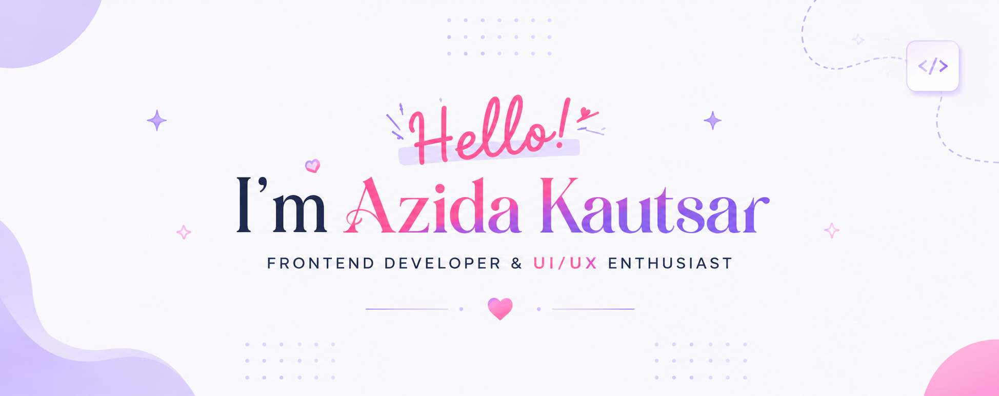

<!-- ===================== HEADER ===================== -->

  

 

<!-- ===================== CONNECT ===================== -->

  
&nbsp;&nbsp;
  

 

## About Me

I'm **Azida Kautsar Milla**, a **Frontend Developer** with a strong passion for building intuitive, responsive, and user-friendly digital experiences.

- 🎨 Passionate about UI/UX Design
- 💻 Experienced in responsive web development
- ⚛️ Experienced with React, Laravel, Flutter, and modern UI/UX tools
- 📱 Flutter Mobile Development
- 🌱 Currently learning advanced frontend architecture
- ✨ I enjoy transforming ideas into modern, accessible, and visually appealing interfaces.

 

## Tech Stack

## GitHub Stats

## GitHub Streak

## Contribution 

